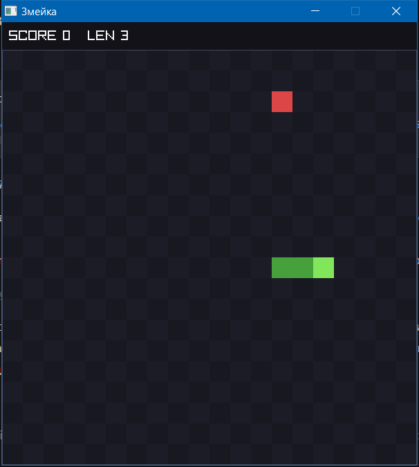

# Змейка 🐍



Классическая «Змейка» на C11 + Raylib — нативное desktop-приложение.
Хардкор-подход: минимум зависимостей, максимум контроля, ноль магии фреймворков.

**Статус: играбельный прототип.** Ядро геймплея готово и покрыто 20 юнит-тестами;
что осталось — пауза, сложность, рекорды и меню, всё отслеживается
в [issues](https://github.com/usazankov/shark/issues) (#10, #12, #14, #15).

## Как играть

| Клавиши        | Действие                                        |
| -------------- | ----------------------------------------------- |
| Стрелки / WASD | поворот (разворот на 180° игнорируется, FR-4)   |
| R / Enter      | рестарт на экране Game Over                     |
| Esc            | выход                                           |

- Еда: +1 к длине, +10 очков (FR-7).
- Скорость растёт каждые 50 очков — от 6 до 15 клеток/с (FR-11).
- Режим поля по умолчанию — **сквозные стены**: вышла за границу — вошла
  с противоположной стороны. Умереть можно только о собственный хвост.
  Классические стены со смертью: `SNAKE_WRAP_WALLS 0` в [src/config.h](src/config.h).
- Ввод буферизуется (очередь из 2 команд) — быстрые связки поворотов
  не теряются (FR-5).

## Стек

- C11 (без расширений) + Raylib — графика/окно/шрифты
- GCC (MinGW-w64, MSYS2 UCRT64), сборка CMake + Ninja
- Тесты: Unity (ThrowTheSwitch) + CTest — логика ядра без окна
- Флаги: `-Wall -Wextra -Wpedantic -Werror -std=c11` — ноль предупреждений (NFR-7)

## Сборка и запуск (Windows)

1. Установить [MSYS2](https://www.msys2.org) (по умолчанию `C:\msys64`).
2. В оболочке «MSYS2 UCRT64»:

   ```bash
   pacman -S --needed mingw-w64-ucrt-x86_64-gcc cmake ninja mingw-w64-ucrt-x86_64-raylib
   ```

3. Сборка и тесты:

   ```bash
   cmake --preset default
   cmake --build build
   ctest --test-dir build
   ./build/snake.exe
   ```

Важно: raylib в MSYS2 есть только в окружении UCRT64. Сборку запускать
из «MSYS2 UCRT64»-оболочки или из терминала с `C:\msys64\ucrt64\bin` в PATH —
без этого gcc не находит собственные DLL и падает без диагностики.

## Документация

| Документ                                                | Что внутри                                          |
| ------------------------------------------------------- | --------------------------------------------------- |
| [docs/requirements.md](docs/requirements.md)            | Требования: 15 FR + NFR, приёмка v1, версия 1.2     |
| [docs/architecture/overview.md](docs/architecture/overview.md) | Принципы: чистое ядро, слои, ADR-решения      |
| [docs/architecture/modules.md](docs/architecture/modules.md) | Структура кода, контракт `tick()` на C, границы |
| [docs/architecture/engineering.md](docs/architecture/engineering.md) | Процесс: коммиты, тесты, цикл задачи      |
| [Issues](https://github.com/usazankov/shark/issues)     | Трекер: каждое FR — issue с состоянием и тестами    |

## Разработка

- Цикл задачи (тест → реализация → рефакторинг → коммит) и правила —
  в [engineering.md](docs/architecture/engineering.md).
- Скиллы ZCode в `.agents/skills/`: `/snake-implement`, `/snake-verify`,
  `/snake-review`.

## План v1

- [x] Каркас проекта: CMake + Ninja + raylib + Unity
- [x] Геймплейное ядро: FR-1…FR-9, FR-11, FR-13 — 20 тестов, `-Werror`
- [x] Режим сквозных стен (FR-8 v1.2, по решению заказчика)
- [ ] FR-10 Пауза — issue #10
- [ ] FR-12 Выбор сложности — issue #12
- [ ] FR-14 Рекорды в файле по сложностям — issue #14
- [ ] FR-15 Меню и поток экранов — issue #15
- [ ] Приёмка v1: чек-лист requirements.md §6 + прогон ASan/Valgrind
